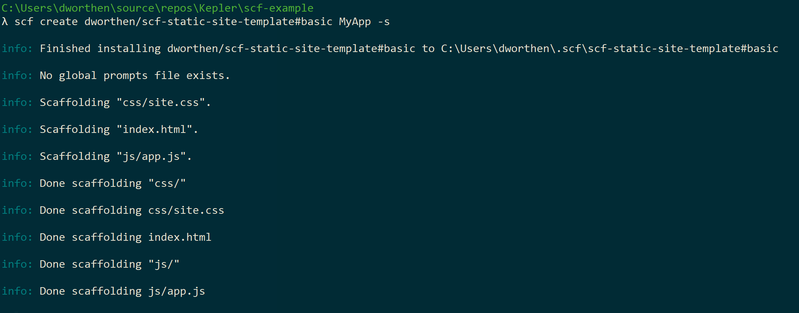
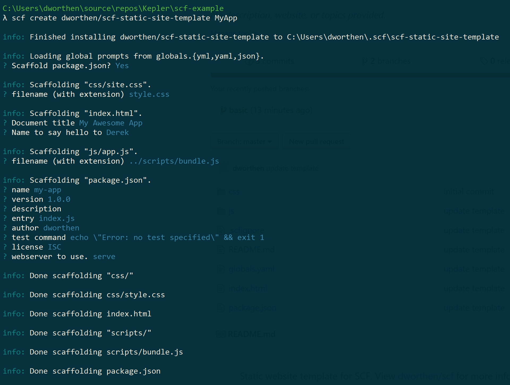

# SCF

A new way to scaffold code, SCF provides a declarative way to build project scaffolders. 

At the most basic level, SCF copies (scaffolds) a directory from one location to another. As SCF copies files, it checks each file to see if it contains [YAML front matter](https://www.npmjs.com/package/yaml-front-matter) (YFM). YFM is not scaffolded out in the final file but is instead used to build CLI prompts. Responses are gathered and then interpolated in the remainging file contents as it is scaffolded out. SCF uses templating engines, [ES template strings](https://www.npmjs.com/package/es6-template-strings) by default, to interpolate prompt variables. Think static site generators, such as [Jekyll](https://jekyllrb.com/docs/front-matter/), that use YFM to scaffold out static websites, only SCF uses YFM to scaffold out command line interfaces and project templates instead.

Any project or directory will work as a template for SCF to scaffold. To build out a custom CLI experience for your project scaffolder, add YFM and ES template strings to files. Doing so adds support for dynamic data and allows you to control the flow of the scaffolding process.

# Usage

```
scf <command> [options]
```

**Commands**

- **Create \<name\> [as]**: Scaffolds out the named template.
- **install \<src\> [as]**: Installs template from github, gitlab or bitbucket.
- **rm \<name>**: Remove template.
- **list**: List available templates. 
- **link [src] [as]**: Link current directory to global templates directory.
- **help \<command>**: Display help for a specific command

**Global options**

- **-h, --help**: Display help
- **-V, --version**: Display version
- **--no-color**: Disable colors
- **--quiet**: Quiet mode - only display warn and error messages.
- **-v, --verbose**: Verbose mode - will also output debug messages.

# Example

Let's start by scaffolding out a simple, predefined static site template.

## 1. Install scf

```shell
npm install scf -g
```

> May also use `npx` instead of installing `scf` globally.

## 2. Scaffold template

```shell
scf create dworthen/scf-static-site-template#basic MyApp -s
```

This command will scaffold out [dworthen/scf-static-site-template/tree/basic](https://github.com/dworthen/scf-static-site-template/tree/basic), a simple static website template, to _MyApp_.



Outputting 

```
MyApp
|-- css
    |-- site.css
|-- js
    |-- app.js
|-- index.html
```

Which matches the contents of [dworthen/scf-static-site-template/tree/basic](https://github.com/dworthen/scf-static-site-template/tree/basic).

This is a straight forward example. None of the template files contain any YFM so SCF only copies the project structure to the desired location, _MyApp_, without prompting for any input.

> The `create` command runs the `install` command internally, if necessary. SCF uses degit to install templates from github, gitlab and butbucket. View [Rich-Harris/degit](https://github.com/Rich-Harris/degit) for more information.

# A more complete example

Let's scaffold a project template that will prompt for input, [dworthen/scf-static-site-template](https://github.com/dworthen/scf-static-site-template).

```shell
scf create dworthen/scf-static-site-template MyApp
```



No code was written to prompt for input. SCF builds CLI prompts from the YFM present in template files. 

The above command and responses produces the following structure. 

```
MyApp
|-- css
    |-- style.css
|-- scripts
    |-- bundle.js
|-- index.html
|-- package.json
```

> `cd MyApp && npm install && npm start` will start up a static file server accessible at `localhost:5000/index.html`.

Notice that the above structure does not quite match [dworthen/scf-static-site-template](https://github.com/dworthen/scf-static-site-template). 

```
dworthen/scf-static-site-template
|-- css
    |-- site.css
|-- js
    |-- app.js
|-- index.html
|-- package.json
```

For example, _site.css_ was renamed to _style.css_ during the scaffolding process and _app.js_ was not only renamed to _bundle.js_ but was also moved to _scripts/_. SCF let's you rename files and and even move them by using relative paths when scaffolding. 

How does SCF handle file references and links if files can be renamed and moved? Let's take a look at the outputed _MyApp/index.html_ for clues.

```html
<!DOCTYPE html>
<html lang="en">
  <head>
    <meta charset="UTF-8" />
    <meta name="viewport" content="width=device-width, initial-scale=1.0" />
    <meta http-equiv="X-UA-Compatible" content="ie=edge" />
    <title>My Awesome App</title>
    <link rel="stylesheet" href="css/style.css" />
  </head>
  <body>
    <h1>Hello Derek</h1>
    <script src="scripts/bundle.js"></script>
  </body>
</html>
```

Notice that the `link` and `script` elements reference the correct, renamed and moved files, _style.css_ and _scripts/bundle.js_ respectively. _MyApp/index.html_ also references some other information provided during the scaffolding process such as `My Awesome App` and `Derek`. 

Compare this to the template file, [dworthen/scf-static-site-template/blob/master/index.html](https://github.com/dworthen/scf-static-site-template/blob/master/index.html).

```html
---
- filename: index.html
- name: title
  message: Document title
- name: name
  default: World
  message: Name to say hello to
---

<!DOCTYPE html>
<html lang="en">
  <head>
    <meta charset="UTF-8" />
    <meta name="viewport" content="width=device-width, initial-scale=1.0" />
    <meta http-equiv="X-UA-Compatible" content="ie=edge" />
    <title>${title ? title : "Basic HTML Template"}</title>
    <link rel="stylesheet" href="${files['css/site.css'].dest}" />
  </head>
  <body>
    <h1>Hello ${name}</h1>
    <script src="${files['js/app.js'].dest}"></script>
  </body>
</html>
```

The file starts with YFM (content between the opening and closing `---`). YFM is not scaffolded out. Instead, SCF uses YFM to control the flow of the scaffolding process and to prompt for input.

SCF scaffolds out the remaining contents after expanding variables using [ES template string](https://www.npmjs.com/package/es6-template-strings). `${title ? title : "Basic HTML Template"}` demonstrates using a ternary expression within an ES template.

Both `link` and `script` elements reference a `file` object instead of a static path. The file object is a global object accessible to all template files and represents a mapping of original file locations to the scaffolded out location. The following is the `file` object for the current example.

```js
{
  "css/sites.css": {
    dest: "css/style.css"
  },
  "js/app.js": {
    dest: "scripts/bundle.js"
  }
}
```

This allows one to reference other files within a project template without knowing where the referenced files will end up after scaffolding. 

# Prompts

Prompts take the following YAML shape.

- **name\<string> (required)**: The name of the variable that will store the user response.
- **type\<input|number|confirm|list> (optional)**: Type of prompt to display. Defaults to `input`.
- **Choices\<string[]> (required with type=list)**: A list of choices to display when `type` is set to `list`.
- **messge\<string> (optional)**: Message to use when prompting for input.
- **default\<string> (optional)**: Default value if one is not provided.
- **pattern\<RegExp> (optionl)**: Regular expression used to validate user input. May be a string or, as in the above example, a js regular expression using the `!!js/regexp` label.
- **validate\<Function> (optional)**: A js function used to validate user input. Should return either `true` or a string to display when input does not satisfy requirements. Validate and pattern cannot be used together.

Example

```html
---
- name: greeting
  type: list
  choices:
    - Hello
    - Greetings
- name: person
  message: Person to say hello to.
  default: World
  pattern: !!js/regexp /^[A-Z]+.*/
- name: punctuationMark
  message: Define punctuation mark to use.
  validate: !!js/function >
    function(input) {
      return /^[.!]$/.test(input) || `Provided ${input}. Can only use \".\" or !`;
    }
---

<h1>${greeting} ${person}${punctuationMark}</h1>
```

The first prompt presents a list of choices, `Hello` and `Greetings`, and stores the selected choice in a variable titled `greeting`.

The second prompt takes user input and ensures it passes the requirements defined by the `pattern` regular expression before storing it in a variable titled `person`.

The third prompt takes user input and validate it using the `validate` function instead of the `pattern` regular expression. `validate` is more flexible and can provide better feedback for when user input does not meet requirements.

Can use either `pattern` or `validate` to validate user input but not both at the same time. If neither `pattern` nor `validate` is defined then the input is optional and the user may leave the response blank.

## Global prompts

Prompts defined in _globals.yaml_ are prompted first and act as global variables and are accessible to all template files. Since _globals.yaml_ is a YAML file it does not need opening and closing `---`.

# Reserved YAML keys

- **filename\<string> (optional)**: Define the filename, skipping user input when scaffolding. Useful for files that have signicant meaning such as _package.json_ or _webpack.config.js_. _package.json_ and _index.html_ in [dworthen/scf-static-site-template](https://github.com/dworthen/scf-static-site-template) demonstrate using `filename`.
- **templateEngine<es|ejs> (optional)**: set the template engine for rendering. Defaults to `es`.
- **skip\<bool> (optional)**: if `true`, SCF skips scaffolding out the file. 
- **conditions\<object[]> (optional)**: Defines a set of conditions for when the file should be scaffolded out. Conditions are checked against [global prompts](#global-prompts).
  - **conditions object**: 
    - **name\<string> (required)**: name of global prompt variable to check against.
    - **operator\<eq|neq|gt|gte|lt|lte|includes> (required)**: defines how to check against global variable.
    - **value\<any> (required)**: value used to check against global variable.

# Conditional scaffolding

SCF supports conditional scaffolding. Here is an example of using conditions to control when the build file, _webpack.config.js_ in this case, will be scaffolded.

```yaml
---
# webpack.config.js
# Top level conditions are ORed
- conditions:
  # These conditions are ANDed
  - name: useBuildSystem
    operator: eq
    value: true
  - name: useWebpack
    operator: eq
    value: true
# OR
- conditions:
  - name: simpleScaffold
    operator: eq
    value: true
---

# File contents for webpack.config.js
```

SCF scaffolds out the above file if `(useBuildSystem === true && useWebpack === true) || simpeScaffold === true`. This is a contrived example but it demonstrates both ANDed and ORed conditionals. 

Conditions work by checking values against [global prompt](#global-prompts) variables. Here is the _globals.yaml_ file for this example:

```yaml
- name: useBuildSystem
  type: confirm
  message: Do you wish to use a build tool?
- name: useWebpack
  type: confirm
  message: Do you wish to use webpack?
- name: simpleScaffold
  type: confirm
  message: Do you not want to worry about configuration and just scaffold?
```

> _globals.yaml_ is a YAML file and does not need to contain the opening and closing `---` tags.

The _package.json_ and _globals.yaml_ files of [dworthen/scf-static-site-template](https://github.com/dworthen/scf-static-site-template) demonstrates conditional scaffolding.

# Template engines

SCF uses [ES template strings](https://www.npmjs.com/package/es6-template-strings) by default to interpolate variables. [ejs](https://www.npmjs.com/package/ejs) may also be used.

Here is what is available to templates.

- **YFM prompts**: prompts defined within the YFM are available to the template content.

  ```html
  ---
  - name: person
  ---

  <h1>Hello ${person}</h1>
  ```
- **Global prompts**: prompts defined in _globals.yaml_ are accessible in all template files.
- **src\<string>**: The path of the template source, e.g., _css/site.css_.
- **dest\<string>**: Where the file is going to be scaffolded, e.g., _css/style.css_.
- **__path\<object>**: a path object for the destination path as returned by [path.parse](https://nodejs.org/api/path.html#path_path_parse_path)
- **files\<object>**: An object that represents a mapping of template source paths to the selected scaffolded path.

  Example files object
  
  ```js
  {
    "path/to/template/source/file.ext": {
      "dest": "path/to/scaffolded/location/file.ext",
      "__path": { // path.parse object for destion path 
        "root": "",
        "dir": "path/to/scaffolded/location",
        "base": "file.ext",
        "ext": ".ext",
        "name": "file"
      } 
    }
  }
  ```

[dworthen/scf-static-site-template/blob/master/index.html](https://github.com/dworthen/scf-static-site-template/blob/master/index.html) demonstrates using the `files` object to reference files in the `link` and `scripts` elements.

> ES templates support expressions but not statements. This means that ternary expressions are supported but `if` statements or loops are not supported. EJS is a full templating engine and does support conditionals and other control structures.


# Special files

- **globals.yaml**: defines a list of global [prompts](#prompts) that will be accessible to all files and can be used for [conditional scaffolding](#conditional-scaffolding).
- **.scfignore**: [gitignore](https://git-scm.com/docs/gitignore) style ignore file. SCF will ignore files and directories listed in _.scfignore_ when scaffolding. May also define gitignore style ignore rules/globs as an array in `scfignore` key of _package.json_.

# Conditional scaffolding strategies

## Branch based

`scf create dworthen/scf-static-site-template#basic MyApp` and `scf create dworthen/scf-static-site-template MyApp` both scaffolded out [dworthen/scf-static-site-template](https://github.com/dworthen/scf-static-site-template) with one differnce. The former scaffolds out the `basic` branch while the latter scaffolds the `master` branch. 

Template developers can then create multiple branches to support a variety of scaffold templates. The downside to this approach is that consumers need to which branch to target when scaffolding to get their desired project template.  

SCF uses degit to install templates from github, gitlab and butbucket. View [Rich-Harris/degit](https://github.com/Rich-Harris/degit) for more information on targeting specific branches and tags.

## File based using YFM

One can use [global prompts](#global-prompts) and YFM to achieve file-based [conditional scaffolding](#conditional-scaffolding).

For example, the following [global prompts](#global-prompts) (_globals.yaml_) can be used to support multiple js based build tools.

```yaml
- name: buildTool
  message: Select your desired build tool.
  type: list
  choices:
    - webpack
    - rollup
```

The template repo will then contain a _webpack.config.js_ and a _rollup.config.js_ config file. Both files with conditions dictating when each should be scaffolded.

```js
---
- filename: webpack.config.js
- conditions
  - name: buildTool
    operator: eq
    value: webpack
---

// webpack.config.js
```

```js
---
- filename: rollup.config.js
- conditions
  - name: buildTool
    operator: eq
    value: rollup
---

// rollup.config.js
```

SCF scaffolds out the correct config file based on which option the user selects during the scaffolding process. The advantage with this approach is that developers use the same `scf create username/repo <ProjectName>` command. SCF will then prompt the user for which build tool to use. SCF walks the use through the available options. No need to change the target branch or repo in the `scf create` command.   

# Creating an SCF project template

1. Start with a project structure you want to scaffold. 
2. Add [global prompts](#global-prompts) variables with _globals.yaml_.
3. Declaratively define prompts and SCF metadata using YAML front matter.
4. Add [conditions](#conditional-scaffolding) for when a file should be scaffolded out using YAML front matter.
5. Add [ES template strings](#es-template-strings), `${VARIABLE_NAME}`, to replace static content with variables. (Or use [ejs](https://www.npmjs.com/package/ejs))
6. Add [_.scfignore_](#special-files) file to specify which files should be ignored by SCF. _readme_ files are good candidates for _.scfignore_.
7. Use. Can either upload to github and use `scf create username/repo <ProjectName>` Or run `scf link . TEMPLATE_NAME` within the template project directory. Then run `scf create TEMPLATE_NAME <ProjectName>` anywhere. `scf link` works like `npm link`, allowing one to install local templates as global templates and then scaffold them from anywhere.

There is no need for template developers to write generators or code to specify what to prompt users, how to respond to prompts, and how to copy files from one place to another. Instead, template developers start with the directory structure they wish to scaffold and begin to add YFM to declaritively create prompts, ES template strings to support dynamic data, and conditions to determine what is copied and when.

This is the approach taken with [dworthen/scf-static-site-template](https://github.com/dworthen/scf-static-site-template). The `basic` branch shows a simple project directory before adding any YFM or SCF specific content. The `master` branch shows what the project template looks like after adding SCF specific content and YFM. Scaffolding out the `master` branch allows the user to control what is scaffolded out. 

## Sample SCF project templates

- [dworthen/scf-static-site-template](https://github.com/dworthen/scf-static-site-template). A simple static website template for the purpose of demonstrating SCF features. 
- [dworthen/scf-svelte-app](https://github.com/dworthen/scf-svelte-app-template). A template for [svelte](https://svelte.dev/) apps.

# TODO

A todo list is accumulating at [dworthen/scf/issues/1](https://github.com/dworthen/scf/issues/1).

<!-- # Types of scaffolding

Typically there are two types of templates to scaffold. 

1. **Project templates** are for scaffolding out an entire project, as in the above example. Project templates are good candidates for installing globally using `-g`. Again, the above example installs `dworthen/scf-static-site-template` as a global template using `-g` and renames it to `static-site`. From there, we can scaffold out `static-site` anywhere using `scf create static-site`.
2. **Component templates** are templates for scaffolding out individual aspects of a project. By component I mean any component of a project that gets created over and over again. Examples include scaffolding out a Model or Controller or View for some MVC framework. Or, scaffolding out consistent React class components. Component templates are great candidates for installing locally within the app project and can committed to source control. That way, all developers will have access to the same scaffolding templates and will create components that are stylistically consistent.  -->
