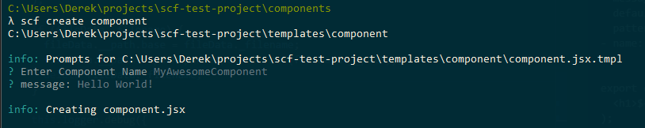
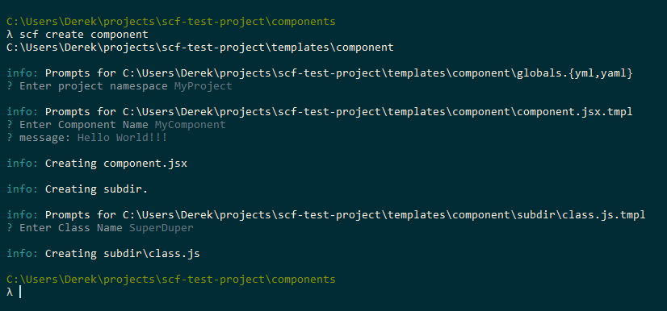
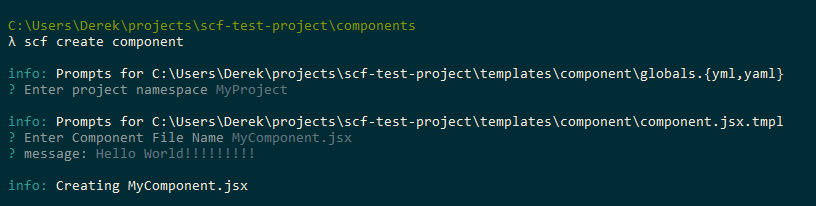

# SCF

Simple, declarative, project-based scaffolding. 

Use Scf to scaffold out entire project structures or to scaffold single files such as a Controller, Model or View for some MVC framework. 

# Install

```shell
$ npm install scf -g
```

> **NOTE**
> May also install locally and setup npm scripts or use npx to run scf commands.

# Benefits

## Project-based

Scaffoldable templates may be defined and installed globally or per project. Project based templates live with the project and may be checked into source code, providing every developer access to the same scaffold templates.

## Declarative 

Tools like [Yeoman.io](http://yeoman.io/) require users to define CLI arguments and implement code to determine how to respond to user input and how to scaffold out project templates.  

Scf takes a simple declarative approach. With Scf, simply create the final project structure and files that should be scaffolded out. Template files may define prompts/variables to use within the file. As Scf scaffolds out the project it will prompt the user for data needed for the current file.   

## Simple

Due to the declarative nature, defining Scf templates is easy. Create the directory structure to scaffold out and within template files, define prompts to ask the user while scaffolding. 

Use Scf to scaffold out entire project structures or to scaffold single files such as Controllers, Models or Views for some MVC framework. 

# Example

## Project Structure

Within a project, create a _templates_ directory to store Scf templates.

```
Project
|-- templates/
    |-- Component
|-- components/
```

Each directory within _templates_ represents a directory structure that `scf` can scaffold. For example, running `$ scf create component` will scaffold out the directory structure and files present in _templates/Component_ within the current working directory.

> **Note**
> May use a different directory than _templates_ to store scf templates. See usage for more information.

## Template Files

Create _templates/Component/component.jsx.tmpl_ and add the following content.

```
---
- name: componentName
  message: Enter Component Name
  default: MyComponent
  pattern: !!js/regexp /[A-Z]\w*Component/
- name: message
---

export const ${componentName} = (props) => (
  <h1>${message ? message : "My Component"}</h1>
);
```

> **Note**
> Using the _.tmpl_ extension is optional.

## Yaml Front Matter

Template files may contain yaml front matter, the content between `---` in the above example. The yaml front matter in templates represents a list of questions, or prompts, to ask the user during the scaffolding process. Prompts take the following shape.

- **name (required)**: The variable name that will store the user response.
- **messge (optional)**: Message to use when prompting the user.
- **default (optional)**: Default value if one is not provided.
- **pattern (optionl)**: Regular expression used to validate user input. May be a string or, as in the above example, a js regular expression using the `!!js/regexp` label.

Template files have access to prompt variables using ES6 template string syntax, `${VARIABLE_NAME}`. Note that this syntax supports expressions but does not support statements. This means that ternary expressions are supported but `if` statements or loops are not supported.

## Scaffolding

```shell
Project/components$ scf create component
```

The above command will scaffold out _templates/component/_ within the current working directory, prompting for input along the way.



The above example will create _components/component.jsx_ with the following content.

```js
export const MyAwesomeComponent = (props) => (
  <h1>Hello World!</h1>
);
```

## Global prompts

Prompts defined in _templates/global.yml_ will be accessible in all template files.

```
Project
|-- templates/
    |-- Component/
        |-- component.jsx.tmpl
        |-- subdir/
            |-- class.js.tmpl
        |-- globals.yml
|-- components/
```

**_globals.yml_**

```yaml
- name: namespace
  message: Enter project namespace
```

The `namespace` variable will be accessible in all template files. Note that `namespace` is optional since a pattern is not defined.

Update **_component.jsx.tmpl_** to use the global `namespace` prompt variable.

```
---
- name: componentName
  message: Enter Component Name
  default: MyComponent
  pattern: !!js/regexp /[A-Z]\w*Component/
- name: message
---

// namespace is optional
export const ${namespace}${namespace ? "_" : ""}${componentName} = (props) => (
  <h1>${message ? message : "My Component"}</h1>
);
```

Other template files also have access to `namespace`. For example, **_subdir/class.js.tmpl_**

```
---
- name: className
  message: Enter Class Name
  pattern: !!js/regexp /[A-Z]\w*/
---

// namespace is optional
export class ${namespace}${namespace ? "_" : ""}${className} {

}
```

**Scaffolding**

```shell
Project/components$ scf create component
```



## Renaming files

The `_filename` prompt is a reserved prompt used to change the name of the current template file being scaffolded. `_filename` is the one template prompt not accessible to the template, it's just used to change the filename.

## __path Global

Template files have access to a `__path` variable that represents the current file. The `__path` object is the same as the one returned by [Path.parse](https://nodejs.org/api/path.html#path_path_parse_path).

### Using _filename and __path

Let's modify **_templates/component/component.jsx.tmpl_** to prompt for a filename and use that filename to name the exported component. 

```
---
- name: _filename
  message: Enter Component File Name
  default: MyComponent.jsx
  pattern: !!js/regexp /[A-Z]\w*Component.jsx/
- name: message
---

// namespace is optional
// using __path.name to name the component based on
// the filename
export const ${namespace}${namespace ? "_" : ""}${__path.name} = (props) => (
  <h1>${message ? message : "My Component"}</h1>
);
```

**Scaffolding**

```shell
Project/components$ scf create component
```



# Usage

```shell
$ scf -h
```